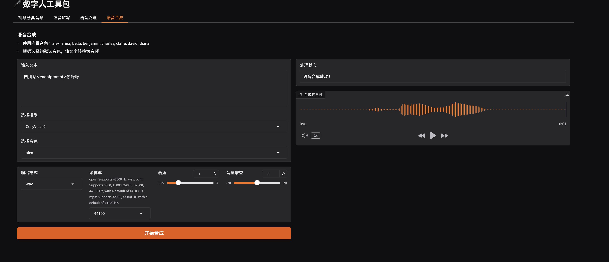

# 数字人工具包 (Digital Human Tools)

这个项目提供了一套用于数字人开发的工具集合，包括视频音频分离、语音转写、语音克隆和语音合成等功能。

## 功能界面展示

### 语音克隆界面


### 语音转写界面


### 视频分离音频界面


### 语音合成界面


### 语音管理界面


## 功能特点

- 🎥 **视频分离音频**：从视频文件中提取音频，支持指定时间段
- 🎯 **语音转写**：将音频文件转换为文本，使用 FunAudioLLM/SenseVoiceSmall 模型
- 🗣️ **语音克隆**：基于参考音频生成克隆语音，支持多个模型选择
- 🔊 **语音合成**：支持内置音色和克隆音色的文本转语音
- 📋 **语音管理**：管理和删除已创建的克隆音色

## 安装说明

1. 克隆项目到本地：
```bash
git clone git@github.com:jiaqianjing/digital_human_tools.git
cd digital_human_tools
```

2. 安装 uv：
```bash
curl -fsSL https://astral.sh/uv/install.sh | sh
```

3. 使用 uv 安装依赖：
```bash
uv sync
```

4. 配置环境变量：
创建 `.env` 文件并添加以下配置：
```
SILICONFLOW_API_KEY=your_api_key_here
```

## 使用方法

运行应用：
```bash
uv run python app.py
```

启动后，可以通过浏览器访问本地服务：`http://localhost:7860`

### 功能模块说明

1. **视频分离音频**
   - 上传视频文件（支持 mp4 格式）
   - 可选择指定开始时间（HH:MM:SS）和持续时间
   - 使用 ffmpeg 提取音频
   - 自动下载转换后的音频文件

2. **语音转写**
   - 支持上传音频文件
   - 使用 FunAudioLLM/SenseVoiceSmall 模型
   - 自动转写为文本内容

3. **语音克隆**
   - 上传参考音频
   - 输入参考音频对应的文本
   - 支持音频自动转写功能
   - 设置克隆音色 ID
   - 输入目标生成文本
   - 提供多个模型选择：
     - CosyVoice2
     - Fish Speech
     - GPT-SoVITS

4. **语音合成**
   - 支持文本转语音
   - 提供多种内置音色：alex, anna, bella, benjamin, charles, claire, david, diana
   - 支持使用克隆音色
   - 可调整参数：
     - 语速（0.25-4.0）
     - 音量增益（-20到20）
     - 输出格式（mp3, opus, wav, pcm）
     - 采样率（8000-48000Hz）

5. **语音管理**
   - 查看已创建的克隆音色列表
   - 刷新音色列表
   - 删除不需要的克隆音色

## 技术栈

- Python
- Gradio（Web界面框架）
- SiliconFlow API（语音服务）
- FFmpeg（视频处理）

## 注意事项

- 使用前请确保已配置正确的 SILICONFLOW_API_KEY
- 音频文件支持常见格式（wav, mp3等）
- 视频文件支持 mp4 格式
- opus 格式仅支持 48000Hz 采样率
- wav/pcm 格式支持 8000-48000Hz 采样率
- mp3 格式支持 32000Hz 和 44100Hz 采样率

## 贡献指南

欢迎提交 Issue 和 Pull Request 来帮助改进项目。

## 许可证

[MIT]
