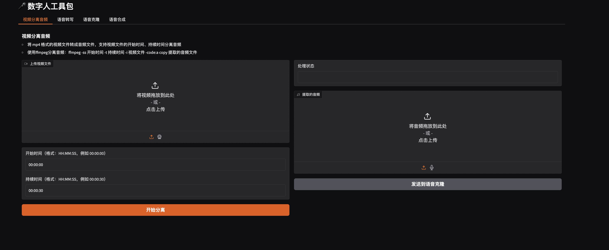

# 数字人工具包 (Digital Human Tools)

这个项目提供了一套用于数字人开发的工具集合，包括视频音频分离、语音转写和语音克隆等功能。

## 功能界面展示

### 语音克隆界面


### 语音转写界面


### 视频分离音频界面


## 功能特点

- 🎥 **视频分离音频**：从视频文件中提取音频，支持指定时间段
- 🎯 **语音转写**：将音频文件转换为文本
- 🗣️ **语音克隆**：基于参考音频生成克隆语音，支持多个模型选择

## 安装说明

1. 克隆项目到本地：
```bash
git clone git@github.com:jiaqianjing/digital_human_tools.git
cd digital_human_tools
```

2. 安装 uv：
```bash
curl -fsSL https://astral.sh/uv/install.sh | sh
```

3. 使用 uv 安装依赖：
```bash
uv pip install .
```

3. 配置环境变量：
创建 `.env` 文件并添加以下配置：
```
SILICONFLOW_API_KEY=your_api_key_here
```

## 使用方法

运行应用：
```bash
uv run python app.py
```

启动后，可以通过浏览器访问本地服务：`http://localhost:7860`

### 功能模块说明

1. **视频分离音频**
   - 上传视频文件
   - 可选择指定开始时间和持续时间
   - 自动提取并下载音频文件

2. **语音转写**
   - 支持上传音频文件
   - 自动转写为文本内容

3. **语音克隆**
   - 支持上传参考音频
   - 提供多个模型选择：
     - CosyVoice2
     - Fish Speech
     - GPT-SoVITS
   - 可自定义生成文本内容

## 技术栈

- Python
- Gradio（Web界面框架）
- SiliconFlow API（语音服务）

## 注意事项

- 使用前请确保已配置正确的 API Key
- 音频文件支持常见格式（wav, mp3等）
- 视频文件支持主流格式（mp4, avi等）

## 贡献指南

欢迎提交 Issue 和 Pull Request 来帮助改进项目。

## 许可证

[MIT]
