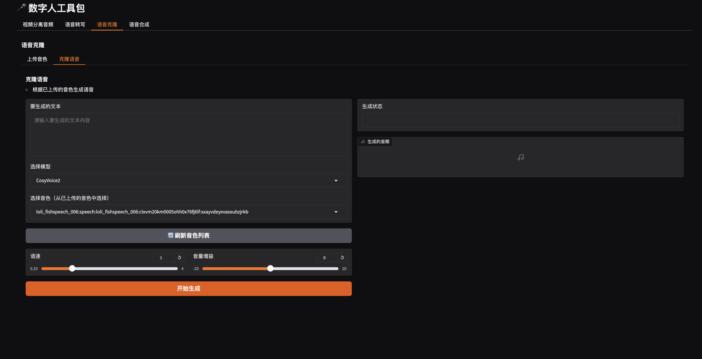

# 数字人工具包 (Digital Human Tools)

这个项目提供了一套用于数字人开发的工具集合，包括视频音频分离、语音转写、语音克隆和语音合成等功能。

## 功能界面展示
### 视频分离音频界面


### 语音转写界面


### 语音克隆界面



### 语音合成界面


## 主要功能

- 🎥 **视频分离音频**：从视频文件中提取音频，支持指定开始时间和持续时间
- 🎯 **语音转写**：将音频文件转换为文本，使用 FunAudioLLM/SenseVoiceSmall 模型
- 🗣️ **语音克隆**：基于参考音频生成克隆语音，支持多种高质量模型
   * 上传音色（克隆音色）
   * 选中指定的音色，文字转语音
- 🔊 **语音合成**：支持内置音色文本转语音，可调整语速、音量等参数

## 安装说明

1. 克隆项目到本地：
```bash
git clone git@github.com:jiaqianjing/digital_human_tools.git
cd digital_human_tools
```

2. 安装 uv 包管理工具：
```bash
curl -fsSL https://astral.sh/uv/install.sh | sh
```

3. 使用 uv 安装依赖：
```bash
uv sync
```

4. 配置环境变量：
创建 `.env` 文件并添加以下配置：
```
SILICONFLOW_API_KEY=your_api_key_here
```

## 使用方法

运行应用：
```bash
uv run python app.py
```

启动后，可以通过浏览器访问本地服务：`http://localhost:7860`

### 功能模块详解

#### 1. 视频分离音频
   - **功能**：从视频文件中提取音频内容
   - **支持**：
     - 上传视频文件（支持 mp4 格式）
     - 指定开始时间（HH:MM:SS）和持续时间
     - 使用 ffmpeg 提取精确时间段的音频
   - **便捷操作**：
     - 一键发送到【语音克隆】模块的【上传参考音频】功能

#### 2. 语音转写
   - **功能**：将音频内容转换为文本
   - **支持**：
     - 上传音频文件（支持多种常见格式）
     - gradio 控件支持上传视频自动转音频，并支持截取指定片段
   - **模型**：使用 FunAudioLLM/SenseVoiceSmall 模型进行高精度转写

#### 3. 语音克隆
   - **上传音色**：
     - 上传参考音频（支持多种格式，也可从视频分离）
     - 输入参考音频对应的文本（支持自动转写功能）
     - 自定义克隆音色ID
     - 支持音色列表的刷新和管理
   - **克隆语音**：
     - 输入目标生成文本
     - 选择已上传的音色
     - 调整语速和音量参数
   - **多模型支持**：
     - CosyVoice2
     - Fish Speech
     - GPT-SoVITS

#### 4. 语音合成
   - **功能**：将文本转换为语音
   - **音色选择**：
     - 内置音色：alex, anna, bella, benjamin, charles, claire, david, diana
   - **音色管理**：
     - 查看已创建的克隆音色列表
     - 刷新音色列表
     - 删除不需要的克隆音色
   - **参数调整**：
     - 语速（0.25-4.0倍速）
     - 音量增益（-20到20 dB）
     - 输出格式（mp3, opus, wav, pcm）
     - 采样率（8000-48000Hz，根据格式有不同限制）

## 技术栈

- **后端**：Python
- **前端**：Gradio（轻量级Web界面框架）
- **API服务**：SiliconFlow API（高质量语音服务）
- **媒体处理**：FFmpeg（视频音频处理）

## 注意事项

- 使用前请确保已配置正确的 SILICONFLOW_API_KEY
- 音频文件支持常见格式（wav, mp3等）
- 视频文件支持 mp4 格式
- 不同输出格式的采样率限制：
  - opus 格式仅支持 48000Hz 采样率
  - wav/pcm 格式支持 8000-48000Hz 采样率
  - mp3 格式支持 32000Hz 和 44100Hz 采样率

## 贡献指南

欢迎提交 Issue 和 Pull Request 来帮助改进项目。如有任何问题或建议，请联系项目维护者。

## 许可证

[MIT](LICENSE)
